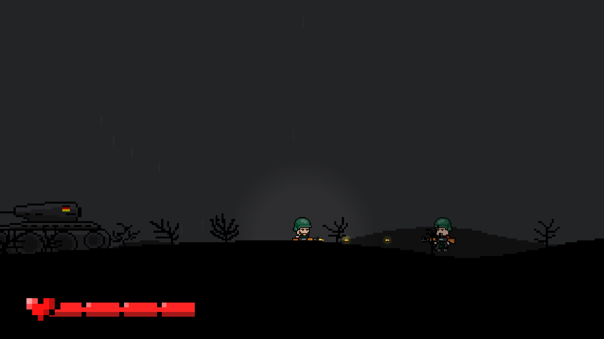

# 2D Shooter Game

Welcome to a 2D shooter game, where you step into the boots of a brave soldier 🪖, fighting to survive and conquer in a chaotic battlefield! 




## Game Features

### Currently Available
- 🎮 **Smooth Controls**: Navigate the soldier with **W-A-S-D**   
- 🔫 **Weapons**:  
  **Rifle** – A trusty weapon to take down enemies.  

- 🪖 **Levels**:  
  -  One level with two enemies to defeat.  
  -  Win by eliminating both enemies.

# 🕹️ How to Play
1. **Move**: Use **W-A-S-D** to control the soldier.  
2. **Attack**: Press the **Spacebar** to shoot bullets.
3. **Win**: Defeat both enemies to complete the level!


## 🖥️ Installation

1. Clone the repository:  
   ```bash
   git clone https://github.com/tdimitr/2D-Shooter-Game.git
2. Run the `2D Shooter War Theme.exe` file to start the game.


